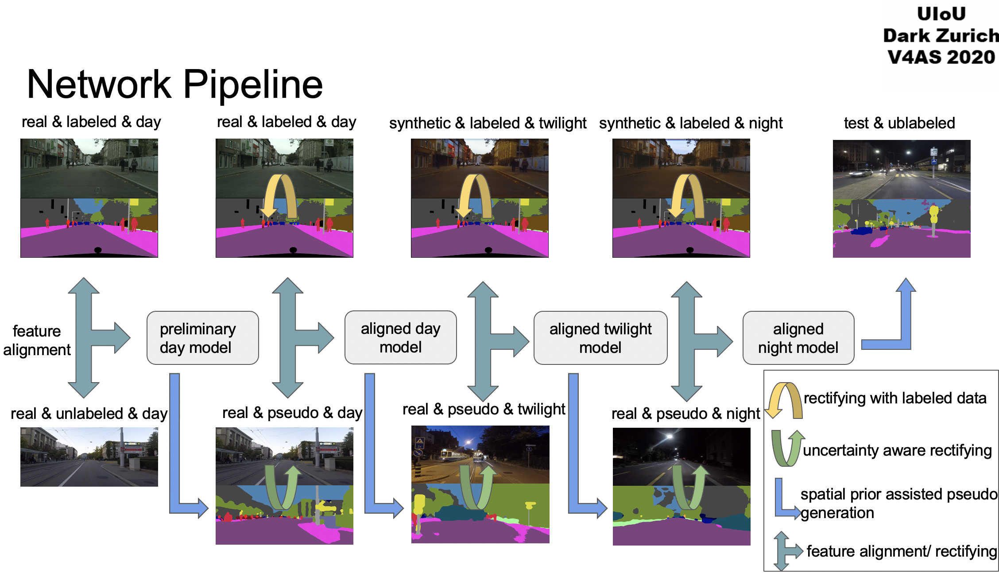
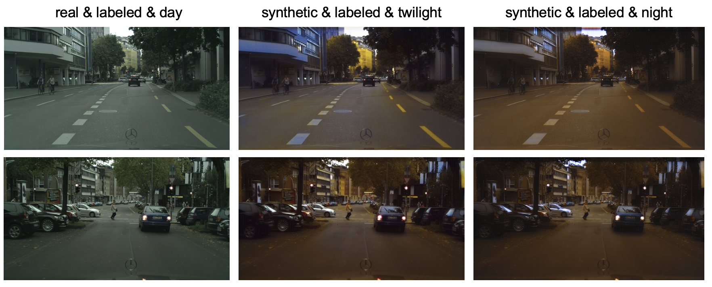

# Uncertainty Aware Curriculum Domain Adaptation


[](https://opensource.org/licenses/MIT)

In this repo, we provide our 1st place code for [The UIoU Dark Zurich Challenge @ Vision for All Seasons Workshop, CVPR 2020](https://competitions.codalab.org/competitions/23553)  and our presentation PPT is [here](https://docs.google.com/presentation/d/13GjTLn7dup-3I8H-KW4Zx2cwesHjKoE44SlfsKo66v8/edit?usp=sharing).

We proposed Uncertainty Aware Curriculum Domain Adaptation pipeline to solve the adaptation problem. Different from [1] and [2] we don't use GPS corresponding relations in this solution thus it is more general.

## Pipeline



## Prerequisites
- Python 3.6
- GPU Memory >= 11G (e.g., GTX2080Ti or GTX1080Ti)
- Pytorch 

## Prepare Data

### Download Dataset
Download [Dark Zurich Dataset] and [Cityscapes] to run the basic code.

- Download [The Dark Zurich Dataset]( https://www.trace.ethz.ch/publications/2019/GCMA_UIoU/ )

- Download [The Cityscapes Dataset]( https://www.cityscapes-dataset.com/ )

### Prapare Twilight and nighttime Cityscapes Dataset

For performing gradually adaptation from day to night, we need to generate labeled twilight and nighttime cityscapes datasets using cyclegan. We use [this](https://github.com/junyanz/pytorch-CycleGAN-and-pix2pix) repo in the challenge.

Here are some results:


### Generate Image Lists

After generating twilight and nighttime cityscapes training images, we need to prepare image lists for the convenience of training and test.

We create a path dict containing all training images lists in `./dataset/all_file_paths.py`. Every text file contains corresponding traing images' absolute path except for those marked with `autogenerated`. They are the indexes of images which will be generated during training.

```
all_file_paths = {
# cityscapes
'city_day_imgs_txt':'cityscapes_day.txt',
'city_night_imgs_txt':'cityscapes_night.txt',
'city_twilight_imgs_txt':'cityscapes_twilight.txt',
'city_lbls_txt': 'gts.txt',

# dark zurich
'zurich_day_imgs_txt':'zurich_day.txt',
'zurich_day_plbls_txt':'./file_lists/zurich_day_plbls.txt', # autogenerated

'zurich_night_imgs_txt':'zurich_night.txt',
'zurich_night_plbls_txt':'./file_lists/zurich_night_plbls.txt', # autogenerated

'zurich_twilight_imgs_txt':  'zurich_twilight.txt',
'zurich_twilight_plbls_txt': './file_lists/zurich_twilight_plbls.txt', #auto generated

'zurich_test_imgs_txt': 'zurich_night_test.txt',
'zurich_val_imgs_txt': 'zurich_night_val.txt',
}
```


## Training and Test

As there are many training steps in our pipeline, we manage our training procedure in the `train_all_states_gradual.py` for convenience.
```
1.From cityscapes day to dark zurich day
  -- Generate aligned model - day_to_day
  -- Generate pseudo label - gen_day_pseudo
  -- Finetune with pseudo - ft_day_pseudo

2.From day to twilight
  -- Generate rectified model - day_to_twilight
  -- Generate pseudo label - gen_twilight_pseudo
  -- Finetune with pseudo - ft_twilight_pseudo

3.From twilight to night
  -- Generate rectified model - twilight_to_night
  -- Generate pseudo label - gen_night_pseudo
  -- Finetune with pseudo - ft_night_pseudo

4.Test on dark zurich night - gen_test_result
```

## Pretrained Model

Coming soon ...

## Related Works
We also would like to thank great works as follows:

[1][GCMA](https://www.trace.ethz.ch/publications/2019/GCMA_UIoU/GCMA_UIoU-Sakaridis+Dai+Van_Gool-ICCV_19.pdf)

[2][MGCDA](https://www.trace.ethz.ch/publications/2019/GCMA_UIoU/MGCDA_UIoU-Sakaridis+Dai+Van_Gool-IEEE_TPAMI_20.pdf)

[3][MRNet](https://arxiv.org/pdf/1912.11164.pdf)

[4][MRNet+Rectifying](https://arxiv.org/pdf/2003.03773.pdf)

[5]https://github.com/layumi/Seg-Uncertainty

[6]https://github.com/wasidennis/AdaptSegNet

[7]https://github.com/RoyalVane/CLAN

[8]https://github.com/yzou2/CRST